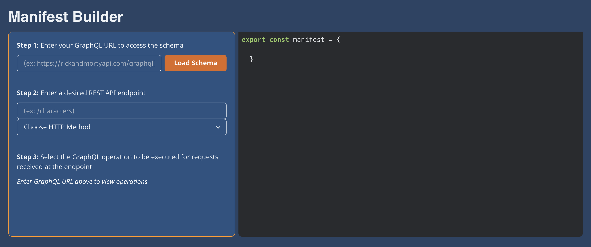

# MONARQ Companion Application

**MONARQ** is a lightweight NPM Package which expands your Express/GraphQL server to accept REST requests. This application contains a user friendly GUI to easily create the required Manifest Object. Due to the specification, here the user can take the guess work out of creating their own Manifest Obejct. Simply use the input fields, add to the accompanying object, then copy and paste the completed Manifest Object into your application. 

Visit our website [MONARQ.io](http://monarq.io/) to see the application code in action, create the Manifest Object, and learn more about the NPM Package. 

Visit [MONARQ](https://github.com/oslabs-beta/MONARQ)'s GitHub or [MONARQ](https://www.npmjs.com/package/monarq)'s NPM page for further information on **MONARQ**. 

# How To Use

_Step 1:_ Navigate to the Manifest Builder within [MONARQ.io](http://monarq.io/). Then press 'Get Started'.

_Step 2:_ 

# Contributors

[Peter Baniuszewicz](https://www.linkedin.com/in/peterbaniuszewicz/) [@Peter-Ba](https://github.com/Peter-Ba)

[Amy Chen](https://www.linkedin.com/in/amyechen) [@designal46](https://github.com/designal46)

[Tyler Kneidl](https://www.linkedin.com/in/tylerkneidl/) [@tylerkneidl](https://github.com/tylerkneidl)

[Helen Regula](https://www.linkedin.com/in/helen-regula/) [@helenregula](https://github.com/helenregula)
