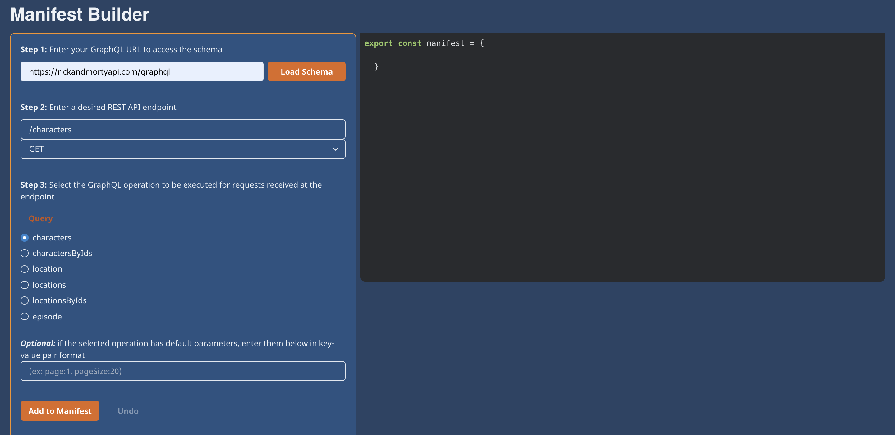
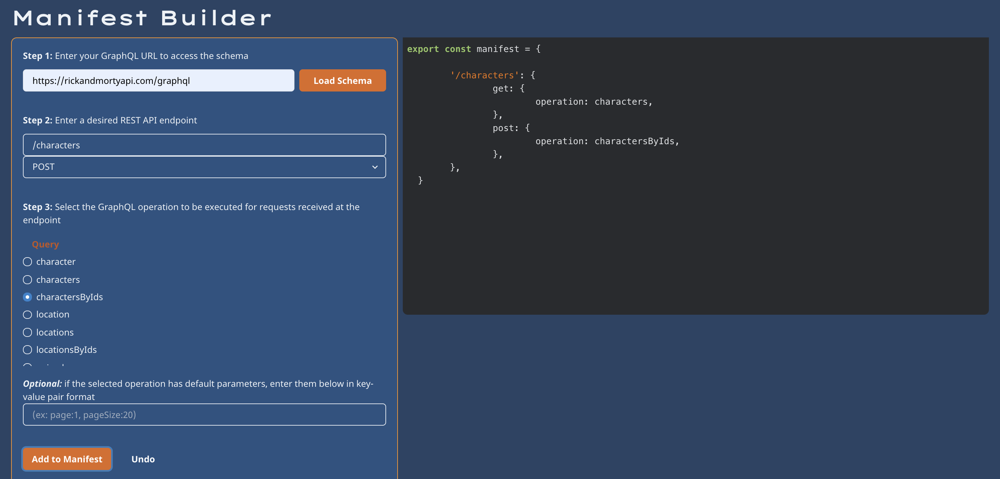

# MONARQ Companion Application

**MONARQ** is a lightweight NPM Package which expands your Express/GraphQL server to accept REST requests. This application contains a user friendly GUI to easily create the required Manifest Object. Due to the specification, here the user can take the guess work out of creating their own Manifest Obejct. Simply use the input fields, add to the accompanying object, then copy and paste the completed Manifest Object into your application. 

Visit our website [MONARQ.io](http://monarq.io/) to see the application code in action, create the Manifest Object, and learn more about the NPM Package. 

Visit [MONARQ](https://github.com/oslabs-beta/MONARQ)'s GitHub or [MONARQ](https://www.npmjs.com/package/monarq)'s NPM page for further information on **MONARQ**. 

# How To Use

_Step 1:_ Navigate to the Manifest Builder within [MONARQ.io](http://monarq.io/). Then press 'Get Started'.

_Step 2:_ Simply add your GraphQL URL to the first input box. This will allow for the application to access your schema which is integral to creating the Manifest Object.

_Step 3:_ Once your schema has loaded, declare the REST endpoints and the REST request method that will be open to the client. Select the query or mutation that will be run within these designated endpoints.

Then click "Add to Manifest"

_Step: 4_ Now your Manifest Object is populated with your inputs! Keep adding endpoints and/or methods that you want to open to the client sending REST Requests.

_Step: 5_ Once you have populated the Manifest Object with the desired endpoints and methods, copy and paste the code into a file within your application. 

_Step 6:_ Import the Manifest Object into your top level server file and invoke the functions within [MONARQ](https://www.npmjs.com/package/monarq)'s NPM package. Pass in this created Manifest Object into both functions based on the instructions. Now you will not run the risk of having a Manifest Object that is incorrect.

# Contributors

[Peter Baniuszewicz](https://www.linkedin.com/in/peterbaniuszewicz/) [@Peter-Ba](https://github.com/Peter-Ba)

[Amy Chen](https://www.linkedin.com/in/amyechen) [@designal46](https://github.com/designal46)

[Tyler Kneidl](https://www.linkedin.com/in/tylerkneidl/) [@tylerkneidl](https://github.com/tylerkneidl)

[Helen Regula](https://www.linkedin.com/in/helen-regula/) [@helenregula](https://github.com/helenregula)
